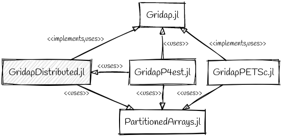

# GridapDistributed.jl

Documentation of the `GridapDistributed.jl` library.

!!! note

     These documentation pages are under construction.

## Introduction

The ever-increasing demand for resolution and accuracy in mathematical models of physical processes governed by systems of Partial Differential Equations (PDEs) can only be addressed using fully-parallel advanced numerical discretization methods and scalable solution methods, thus able to exploit the vast amount of computational resources in state-of-the-art supercomputers. To this end, `GridapDistributed.jl` is a registered software package which provides fully-parallel distributed memory data structures and associated methods for the Finite Element (FE) numerical solution of PDEs on parallel computers. Thus, it can be run on multi-core CPU desktop computers at small scales, as well as on HPC clusters and supercomputers at medium/large scales. The data structures in `GridapDistributed.jl` are designed to mirror as far as possible their counterparts in the `Gridap.jl` Julia software package, while implementing/leveraging most of their abstract interfaces. As a result, sequential Julia scripts written in the high-level Application Programming Interface (API) of `Gridap.jl` can be used verbatim up to minor adjustments in a parallel distributed memory context using `GridapDistributed.jl`.
This equips end-users with a tool for the development of simulation codes able to solve real-world application problems on massively parallel supercomputers while using a highly expressive, compact syntax, that resembles mathematical notation. This is indeed one of the main advantages of `GridapDistributed.jl` and a major design goal that we pursue.

In order to scale FE simulations to large core counts, the mesh used to discretize the computational domain on which the PDE is posed must be partitioned (distributed) among the parallel tasks such that each of these only holds a local portion of the global mesh. The same requirement applies to the rest of data structures in the FE simulation pipeline, i.e., FE space, linear system, solvers, data output, etc. The local portion of each task is composed by a set of cells that it owns, i.e., the **local cells** of the task, and a set of off-processor cells (owned by remote processors) which are in touch with its local cells, i.e., the **ghost cells** of the task.
This overlapped mesh partition is used by `GridapDistributed.jl`, among others, to exchange data among nearest neighbors, and to glue together global Degrees of Freedom (DoFs) which are sitting on the interface among subdomains. Following this design principle, `GridapDistributed.jl` provides scalable parallel data structures and associated methods for simple grid handling (in particular, Cartesian-like meshes of arbitrary-dimensional, topologically n-cube domains), FE spaces setup, and distributed linear system assembly. It is in our future plans to provide highly scalable linear and nonlinear solvers tailored for the FE discretization of PDEs (e.g., linear and nonlinear matrix-free geometric multigrid and domain decomposition preconditioners). In the meantime, however, `GridapDistributed.jl` can be combined with other Julia packages in order to realize the full potential required in real-world applications. These packages and their relation with `GridapDistributed.jl` are overviewed in the next section.

## Building blocks and composability

The figure below depicts the relation among `GridapDistributed.jl` and other packages in the Julia package ecosystem. The interaction of `GridapDistributed.jl` and its dependencies is mainly designed with separation of concerns in mind towards high composability and modularity. On the one hand, `Gridap.jl` provides a rich set of abstract types/interfaces suitable for the FE solution of PDEs. It also provides realizations (implementations) of these abstractions tailored to serial/multi-threaded computing environments. `GridapDistributed.jl` **implements** these abstractions for parallel distributed-memory computing environments. To this end, `GridapDistributed.jl` also leverages (**uses**) the serial realizations in `Gridap.jl` and associated methods to handle the local portion on each parallel task. (See arrow labels in the figure below.)  On the other hand, `GridapDistributed.jl` relies on `PartitionedArrays.jl` in order to handle the parallel execution model (e.g., message-passing via the Message Passing Interface (MPI)), global data distribution layout, and communication among tasks. `PartitionedArrays.jl` also provides a parallel implementation of partitioned global linear systems (i.e., linear algebra vectors and sparse matrices) as needed in grid-based numerical simulations. While `PartitionedArrays.jl` is an stand-alone package, segregated from `GridapDistributed.jl`, it was designed with parallel FE packages such as `GridapDistributed.jl` in mind. In any case, `GridapDistributed.jl` is designed so that a different distributed linear algebra library from `PartitionedArrays.jl` might be used as well, as far as it is able to provide the same functionality. 

|  |
|:--:|
|`GridapDistributed.jl` and its relation to other packages in the Julia package ecosystem. In this diagram, each rectangle represents  a Julia package, while the (directed) arrows represent relations (dependencies) among packages. Both the direction of the arrow and the label attached to the arrows are used to denote the nature of the relation. Thus, e.g., `GridapDistributed.jl` depends on `Gridap.jl` and `PartitionedArrays.jl` , and GridapPETSc depends on `Gridap.jl`  and `PartitionedArrays.jl` . Note that, in the diagram, the arrow direction is relevant, e.g., GridapP4est depends on `GridapDistributed.jl` but not conversely.|

## How to use this documentation

* The first step for new users is to visit the [Getting Started](@ref) page.

* A set of tutorials written as Jupyter notebooks and html pages are available [here](https://github.com/gridap/Tutorials).

* The detailed documentation is in the rest of sections of the left hand side menu. (WIP)

* Guidelines for developers of the Gridap project is found in the [Gridap wiki](https://github.com/gridap/Gridap.jl/wiki) page.

## Julia educational resources

A basic knowledge of the Julia programming language is needed to use the GridapDistributed package.
Here, one can find a list of resources to get started with this programming language.

* First steps to learn Julia form the [Gridap wiki](https://github.com/gridap/Gridap.jl/wiki/Start-learning-Julia) page.
* Official webpage [docs.julialang.org](https://docs.julialang.org/)
* Official list of learning resources [julialang.org/learning](https://julialang.org/learning/)
