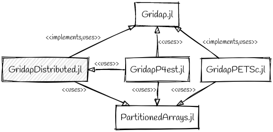

# GridapDistributed.jl

**Parallel finite element computations on distributed-memory machines.**

`GridapDistributed.jl` extends [`Gridap.jl`](https://github.com/gridap/Gridap.jl) to distributed-memory parallel environments using MPI. It mirrors the Gridap sequential API almost exactly: a simulation script written for a single process can be made parallel with minimal changes.

## Installation

`GridapDistributed.jl` is a registered Julia package. We recommend a minimum environment containing `Gridap` (our Finite Elements backend) and `PartitionedArrays` (our distributed arrays backend). To install it, simply run:

```julia
pkg> add Gridap, GridapDistributed, PartitionedArrays
```

## Documentation overview

| Section | What you will find |
|---|---|
| [Backends](@ref backends) | Design goals, serial-to-distributed conversion, debug vs MPI backends |
| [Algebra](@ref algebra) | PartitionedArrays overview: `PRange`, `PVector`, `PSparseMatrix` |
| [Geometry](@ref geometry) | Distributed meshes, ghost cells, Cartesian and unstructured models |
| [FESpaces](@ref fespaces) | DOF numbering, ghost DOFs, multi-field spaces, cell fields |
| [Assembly](@ref assembly) | `Assembled`, `SubAssembled`, `LocallyAssembled` strategies |
| [Adaptivity](@ref adaptivity) | AMR interface, uniform refinement, redistribution, GridapP4est |
| [Visualization](@ref visualization) | Parallel VTK output for ParaView |

## Package ecosystem

`GridapDistributed.jl` is integrated into the Gridap ecosystem. In particular, it can be used together with most packages within the ecosystem, such as:

- [`GridapGmsh.jl`](https://github.com/gridap/GridapGmsh.jl) for mesh generation and import.
- [`GridapSolvers.jl`](https://github.com/gridap/GridapSolvers.jl) and [`GridapPETSc.jl`](https://github.com/gridap/GridapPETSc.jl) for distributed solvers and preconditioners.
- [`GridapP4est.jl`](https://github.com/gridap/GridapP4est.jl) for parallel adaptive mesh refinement.
- [`GridapEmbedded.jl`](https://github.com/gridap/GridapEmbedded.jl) for embedded boundary methods.
- [`GridapTopOpt.jl`](https://github.com/zjwegert/GridapTopOpt.jl) for parallel topology optimization.

|  |
|:--:|
| `GridapDistributed.jl` and its relation to other packages. `Gridap.jl` provides the sequential FE abstractions; `PartitionedArrays.jl` provides the distributed arrays and MPI backend; `GridapDistributed.jl` implements the Gridap abstractions on top of PartitionedArrays. |
