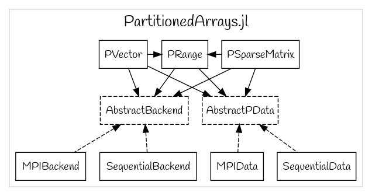

# Summary

GridapDistributed is a library written in the Julia programming language [@ref ] which provides fully-parallel distributed memory data structures for the Finite Element (FE) numerical solution of mathematical models of physical processes governed by Partial Differential Equations (PDEs) on parallel computers, from multi-core CPU desktop computers, to HPC clusters and supercomputers. These distributed data structures are designed to mirror as far as possible their counterparts in the Gridap software package [@ref ], while implementing/leveraging most of their abstract interfaces (see [@ref] for a detailed overview of the software design of Gridap). As a result, sequential Julia scripts written in the high level Application Programming Interface (API) of Gridap can be used verbatim up to minor adjustments in a parallel distributed memory context using GridapDistributed.
This equips end-user applications with a remarkable balance among work-flow productivity, as provided by Gridap APIs, and the vast amount of computational resources in HPC clusters and supercomputers. This is indeed one of the main advantages of GridapDistributed and a major design goal that we pursue.

At present, GridapDistributed provides scalable parallel data structures for simple grid handling (in particular, Cartesian-like meshes of arbitrary-dimensional, topologically n-cube domains), FE spaces setup, and distributed linear system assembly. It is in our future plans to provide highly scalable linear and nonlinear solvers tailored for the FE discretization of PDEs. In the meantime, however, GridapDistributed can be combined with other Julia packages in order to realize the full potential required in real-world applications. These packages are overviewed in the next section. 

# Composability with other packages in the Julia ecosystem

Figure \autoref{fig:building_blocks} ...

{width=50%}
{width=50%}

Left: GridapDistributed and its relation to other packages in the Julia package ecosystem. 
Right: Main software abstractions (data types) in PartitionedArrays and their relations. Dashed boxes represent abstract data types, while regular ones, concrete data types. Dashed arrows represent "implements" relationships (i.e., the type at the tail of the arrow implements the abstract interface associated to the abtract type at the head of the arrow), while regular arrows "uses" relantionships (i.e., the type at the taile of the arrow uses the type and associated methods at the tail of the arrow). 

# Parallel scaling benchmarks 

# Demo application

# Acknowledgements

We acknowledge contributions from Brigitta Sipocz, Syrtis Major, and Semyeong
Oh, and support from Kathryn Johnston during the genesis of this project.

# References

# Julia DOI 10.1137/141000671
# Gridap DOI 10.21105/joss.02520

