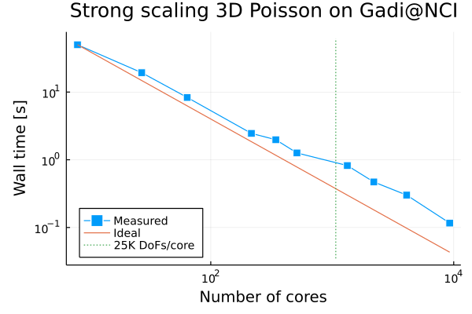
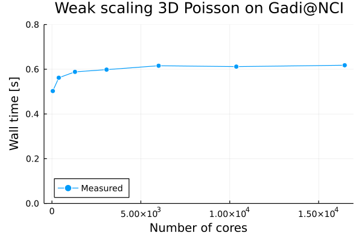
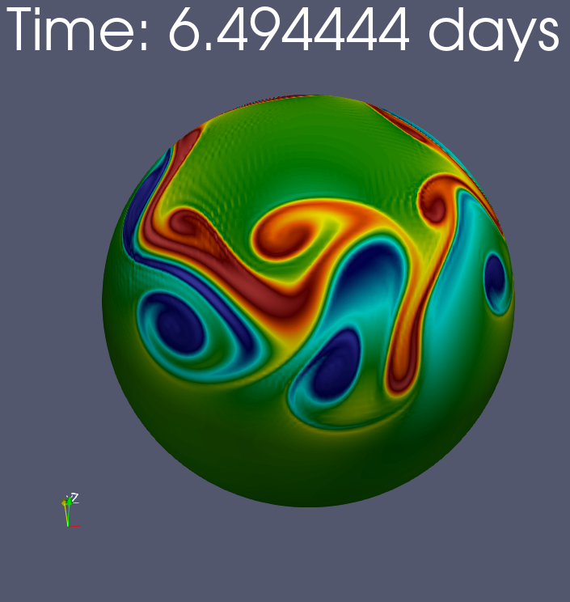
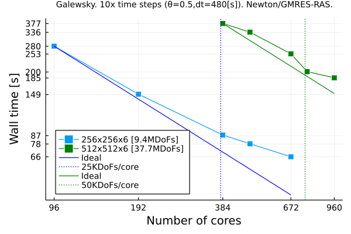

# Summary

GridapDistributed is a registered Julia [@Bezanson2017] software package which provides fully-parallel distributed memory data structures for the Finite Element (FE) numerical solution of mathematical models of physical processes governed by (systems of) Partial Differential Equations (PDEs) on parallel computers, from multi-core CPU desktop computers, to HPC clusters and supercomputers. These distributed data structures are designed to mirror as far as possible their counterparts in the Gridap [@Badia2020] Julia software package, while implementing/leveraging most of their abstract interfaces (see [@Verdugo:2021] for a detailed overview of the software design of Gridap). As a result, sequential Julia scripts written in the high-level Application Programming Interface (API) of Gridap can be used verbatim up to minor adjustments in a parallel distributed memory context using GridapDistributed.
This equips end-users with a tool for the development of simulation codes able to solve real-world application problems on the vast amount of computational resources available at HPC clusters and supercomputers while using a highly expressive, compact syntax, that resembles mathematical notation. This is indeed one of the main advantages of GridapDistributed and a major design goal that we pursue.

In order to scale FE simulations to large core counts, the mesh used to discretize the computational domain on which the PDE is posed must be partitioned (distributed) among the parallel tasks such that each of these only holds a local portion of the global mesh. The same requirement applies to the rest of data structures in the FE simulation pipeline, i.e., FE space, linear system, solvers, data output, etc. The local portion of each task is composed by a set of cells that it owns, i.e., the *local cells* of the task, and a set of off-processor cells (owned by remote processors) which are in touch with its local cells, i.e., the *ghost cells* of the task. [@Badia2020a] 
This overlapped mesh partition is used by GridapDistributed, among others, to exchange data among nearest neighbours, and to glue together global Degrees of Freedom (DoFs) which are sitting on the interface among subdomains. Following this design principle, GridapDistributed provides scalable parallel data structures for simple grid handling (in particular, Cartesian-like meshes of arbitrary-dimensional, topologically n-cube domains), FE spaces setup, and distributed linear system assembly. It is in our future plans to provide highly scalable linear and nonlinear solvers tailored for the FE discretization of PDEs (e.g., linear and nonlinear matrix-free geometric multigrid and domain decomposition preconditioners). In the meantime, however, GridapDistributed can be combined with other Julia packages in order to realize the full potential required in real-world applications. These packages and their relation with GridapDistributed are overviewed in the next section. 

# Building blocks and composability

\autoref{fig:packages} depicts the relation among GridapDistributed and other packages in the Julia package ecosystem. The interaction of GridapDistributed and its dependencies is mainly designed with separation of concerns in mind towards high composability and modularity. On the one hand, Gridap provides a rich set of abstract types/interfaces suitable for the FE solution of PDEs (see [@Verdugo:2021] for more details). It also provides realizations (implementations) of these abstractions tailored to serial/multi-threaded computing environments. GridapDistributed **implements** these abstractions for parallel distributed-memory computing environments. To this end, GridapDistributed also leverages (**uses**) the serial realizations in Gridap and associated methods to handle the local portion on each parallel task. (See \autoref{fig:packages} arrow labels.)  On the other hand, GridapDistributed relies on PartitionedArrays [@parrays] in order to handle the parallel execution model (e.g., message-passing via the Message Passing Interface (MPI) [@mpi40]), global data distribution layout, and communication among tasks. PartitionedArrays also provides a parallel implementation of partitioned global linear systems (i.e., linear algebra vectors and sparse matrices) as needed in grid-based numerical simulations. While PartitionedArrays is an stand-alone package, segregated from GridapDistributed, it was designed with parallel FE packages such as GridapDistributed in mind. We cover the main abstractions and design principles behind PartitionedArrays in the sequel. In any case, GridapDistributed is designed so that a different distributed linear algebra library from PartitionedArrays might be used as well, as far as it is able to provide the same functionality. 

![GridapDistributed and its relation to other packages in the Julia package ecosystem. In this diagram, each rectangle represents  a Julia package, while the (directed) arrows represent relations (dependencies) among packages. Both the direction of the arrow and the label attached to the arrows are used to denote the nature of the relation. Thus, e.g., GridapDistributed depends on Gridap and PartitionedArrays, and GridapPETSc depends on Gridap and PartitionedArrays. Note that, in the diagram, the arrow direction is relevant, e.g., GridapP4est depends on GridapDistributed but not conversely. \label{fig:packages}](packages.png){ width=60% }

As mentioned above, PartitionedArrays is a Julia software package which provides a set of key tools for the distributed-memory parallelization of grid-based discretization methods, such as Finite Difference (FD), Finite Volume (FV) or FE methods. \autoref{fig:parrays} presents the main software abstractions in PartitionedArrays and their relations. With a central role in PartitionedArrays, we have the `AbstractBackend` and `AbstractPData` abstract Julia types. The former is a software abstraction for a group of parallel tasks and the communication layer that orchestrates their concurrent execution. The latter is a low-level abstract type (i.e., users are not exposed to it) representing data partitioned over several chunks or parts (e.g., a global mesh partitioned into several local meshes). The main rationale behind these data types is that they allow to implement parallel algorithms in a generic way (e.g., those associated to the `PRange`, `PVector` and `PSparseMatrix` types, to be covered later) independently of the underlying hardware/message-passing programming model. 

![Main software abstractions in PartitionedArrays and their relations. Dashed boxes represent abstract data types, while regular ones, concrete data types. Dashed arrows represent "implements" relationships (i.e., the type at the tail of the arrow implements the abstract interface associated to the abstract type at the head of the arrow), while regular arrows "uses" relationships (i.e., the type at the tail of the arrow uses the type and associated methods at the head of the arrow).\label{fig:parrays}](parrays.png){ width=60% }

At present, PartitionedArrays (v0.2.8) provides two backends for running generic parallel algorithms, namely  `SequentialBackend` and `MPIBackend`, and their associated `SequentialData` and `MPIData`, resp., `AbstractPData` implementations  (see \autoref{fig:parrays}). With  `SequentialBackend`, the parallel data is split into chunks, and stored in a conventional (sequential) Julia interactive session (typically in an `Array`). The parallel tasks in the algorithm are executed one after the other. Note that `SequentialBackend` does not mean to distribute the data into a single part. The data indeed can be split into an arbitrary number of parts. With `MPIBackend`, chunks of parallel data and parallel tasks are mapped to different MPI processes. End-users applications  are to be executed in MPI mode, e.g., `mpirun -n 4 julia --project=. simulation.jl`.  Using `SequentialBackend`, GridapDistributed users can run their parallel applications during development stage using a standard Julia session, so that they can leverage very useful tools in the Julia development workflow like `Revise` and `Debugger`. This is even more crucial given the current lack of generalized support of Julia in parallel debugging tools. Once the code is robust with `SequentialBackend`, it can be automatically deployed in a supercomputer switching to `MPIBackend`. The library is designed such that other backends like a `ThreadedBackend` (for parallel multi-threaded execution), `DistributedBackend` (for the Julia Distributed programming model), or `MPIXBackend` (for hybrid MPI+X models) may be added in the future. On top of these abstractions, PartitionedArrays provides the `PRange`, `PVector` and `PSparseMatrix` data types. `PRange` implements the `AbstractUnitRange` Julia interface,
and it represents an overlapping partition of a range of global identifiers, e.g., cells in a mesh, DoFs in a FE space, rows/columns in a matrix, or entries in a vector.  Using the methods of `PRange` one, e.g., may retrieve data on ghost cells or DoFs using a nearest neighbour communication. This type is used to describe the parallel data layout of rows and cols in `PVector` and `PSparseMatrix` objects, which represent, respectively, a global vector partitioned into overlapping chunks, and a global sparse matrix into overlapping chunks of rows. 

As mentioned earlier, GridapDistributed offers a built-in Cartesian-like mesh generator, and does not provide, by now,  built-in highly scalable solvers. To address this, as required by real-world applications, one can combine GridapDistributed with GridapP4est [@gridap4est] and GridapPETSc [@gridapetsc] (see \autoref{fig:packages}). The former provides a mesh data structure that leverages the p4est library as highly scalable mesh generation engine [@Burstedde2011]. This engine can mesh domains that can be expressed as a forest of adaptive octrees. The latter enables the usage of the highly scalable solvers (e.g., algebraic multigrid) in the PETSc library [@petsc-user-ref] to be combined with GridapDistributed.

# Parallel scaling benchmark

\autoref{fig:scaling} reports the strong (left) and weak scaling (right) of GridapDistributed when applied to an standard elliptic benchmark PDE problem, namely the 3D Poisson problem. In strong form this problem reads: find $u$ such that $-{\boldsymbol{\nabla}} \cdot (\boldsymbol{\kappa} {\boldsymbol{\nabla}} u) = f$ in $\Omega=[0,1]^3$, with $u = u_{{\rm D}}$ on ${\Gamma_{\rm D}}$ (Dirichlet boundary) and $\partial_{\boldsymbol{n}} u = g_{\rm N}$ on ${\Gamma_{\rm N}}$ (Neumann Boundary); $\boldsymbol{n}$ is the outward unit normal to ${\Gamma_{\rm N}}$. The domain was discretized using the built-in Cartesian-like mesh generator in GridapDistributed. The code was run on the NCI@Gadi Australian supercomputer (3024 nodes, 2x 24-core Intel Xeon Scalable *Cascade Lake* cores and 192 GB of RAM per node) with Julia 1.7 and OpenMPI 4.1.2. For the strong scaling test, we used a fixed **global** problem size resulting from the trilinear FE discretization of the domain using a 300x300x300 hexaedra mesh (26.7 MDoFs) and we scaled the number of cores up to 21.9K cores. For the weak scaling test, we used a fixed **local** problem size of 32x32x32 hexaedra, and we scaled the number of cores up to 16.5K cores. A global problem size of 0.54 billion DoFs was solved for this number of cores.  The reported wall clock time includes: (1) Mesh generation; (2) Generation of global FE space; (3) Assembly of distributed linear system; (4) Interpolation of a manufactured solution; (5) Computation of the residual (includes a matrix-vector product) and its norm. Note that the linear solver time (GAMG built-in solver in PETSc) was not included in the total computation time as it is actually external to GridapDistributed. 

{width=50%}
{width=50%}
\begin{figure}[!h]
\caption{Strong (left) and weak (right) scaling of GridapDistributed when applied to 3D Poisson problem on the Australian Gadi@NCI supercomputer.\label{fig:scaling}}
\end{figure}

\autoref{fig:scaling} shows, on the one hand, an efficient reduction of computation times with increasing number of cores, even far beyond a relatively small load of 25K DoFs per CPU core.
On the other hand, an asymptotically constant time-to-solution (i.e., perfect weak scaling) when the number of cores is increased in the same proportion of global problem size with a local problem size of 32x32x32 trilinear FEs. 

# Demo application

To highlight the ability of GridapDistributed and associated packages (see \autoref{fig:packages}) to tackle real-world problems, and the potential behind its composable architecture, we consider a demo application with interest in the geophysical fluid dynamics community.
This application solves the so-called non-linear rotating shallow water equations on the sphere, 
i.e., a surface PDE posed on a two-dimensional manifold immersed in three-dimensional space.  This complex system of PDEs describes the dynamics of a single incompressible thin layer of constant density fluid with a free surface under rotational effects. It is often used as a test bed for horizontal discretisations with application to numerical weather prediction and ocean modelling. We in particular considered the synthetic benchmark proposed in [@Galewsky2016], which is characterized by its ability to generate a complex and realistic flow.

For the geometrical discretization of the sphere, the software uses the so-called cubed sphere mesh [@Ronchi1996], which was implemented using GridapP4est. The spatial discretization of the equations relies on GridapDistributed to build a **compatible** set of FE spaces [@Gibson2019] for the system unknowns (fluid velocity, fluid depth, potential vorticity and mass flux) grounded on Raviart-Thomas and Lagrangian FEs defined on the manifold [@Rognes2013]. Compatible FEs are a kind of advanced discretization techniques that enable the balanced forces of the continuous equations to be accurately captured in the computational model. The spatial discretization is stabilized using the so-called Anticipated Potential Vorticity Method (APVM) [@Rognes2013]. Time integration is based on a implicit trapezoidal rule, and thus a fully-coupled nonlinear problem has to be solved at each time step. In order to solve this nonlinear problem, we leveraged a Newton-GMRES solver preconditioned with an algebraic preconditioner provided by GridapPETSc (on top of PETSc 3.16).  The  *exact* jacobian of the shallow water system was computed/assembled at each nonlinear iteration.  

\autoref{fig:galewsky_scaling} shows the magnitude of the vorticity field after 6.5 simulation days (left) and the results of a strong scaling study of the model on the Australian Gadi@NCI supercomputer (right). The reported times correspond to the *total* wall time of the first 10 time integration steps; these were the only ones (out of 3600 time steps, i.e., 20 simulation days with a time step size of 480 secs.) that we could afford running for all points in the plot  due to limited computational budget reasons. We considered two different problem sizes, corresponding to 256x256 and 512x512 quadrilaterals/panel cubed sphere meshes, resp.  Overall, \autoref{fig:galewsky_scaling}
confirms a remarkable ability of the ecosystem of Julia packages at hand to efficiently reduce computation times with increasing number of CPU cores for a complex, real-world computational model. 

{width=35%}
{width=55%}
\begin{figure}[!h]
\caption{Magnitude of the vorticity field after 6.5 simulation days with a coarser 48x48 quadrilaterals/panel cubed sphere mesh (left) and strong scaling (right) of the non-linear rotating shallow water equations solver on the Australian Gadi@NCI supercomputer.\label{fig:galewsky_scaling}}
\end{figure}

# Acknowledgements

This research was partially funded by the Australian Government through the Australian Research Council (project number DP210103092), the European Commission under the FET-HPC ExaQUte project (Grant agreement ID: 800898) within the Horizon 2020 Framework Programme and the project RTI2018-096898-B-I00 from the “FEDER/Ministerio de Ciencia e Innovación – Agencia Estatal de Investigación”. F. Verdugo acknowledges support from the Spanish Ministry of Economy and Competitiveness through the “Severo Ochoa Programme for Centers of Excellence in R&D (CEX2018-000797-S)". This work was also supported by computational resources provided by the Australian Government through NCI under the National Computational Merit Allocation Scheme (NCMAS). 

# References

